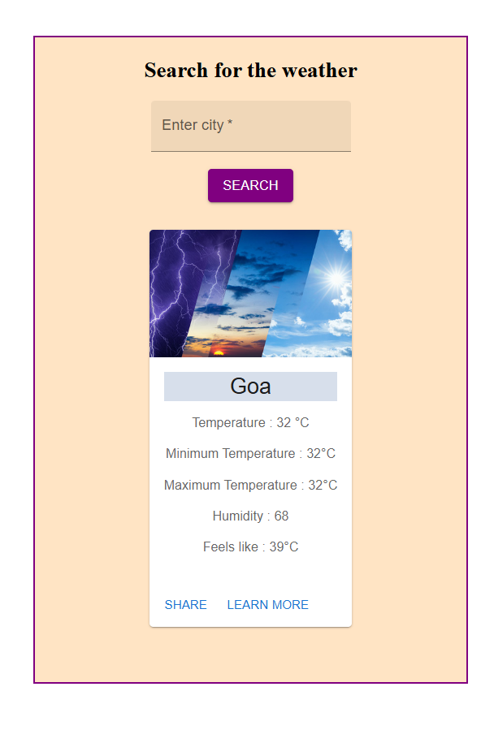

# weather-app
Made a Weather app by integrating an API

🌦 WEATHER APP

A simple and responsive Weather Application built with React + Vite. It integrates the OpenWeatherMap API to provide:

🌍 Location-based search

☁️ Current weather details

🚀 Tech Stack

React + Vite

Material UI (for UI components)

OpenWeatherMap API

📦 INSTALLATION AND SETUP

Clone the repository

git clone <your-repo-link>
cd weather-app-react

Install dependencies

npm install

Create a .env file in the root folder and add your API key:

VITE_WEATHER_API_KEY=your_api_key_here

Start the development server

npm run dev

📷 Screenshots

